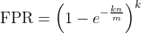
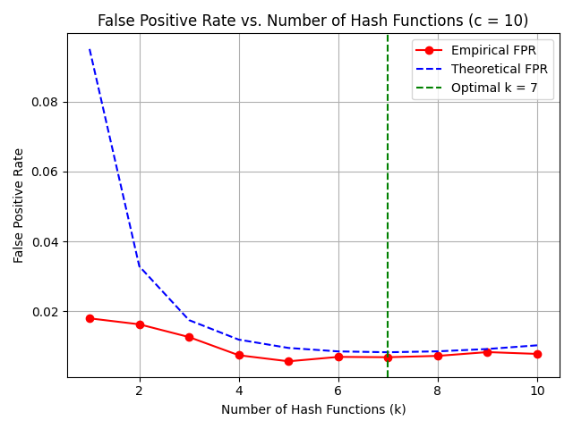
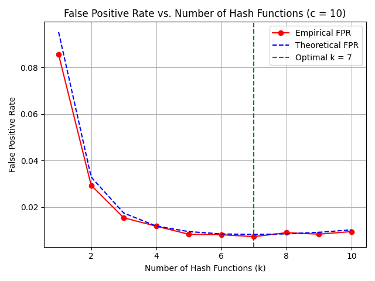

# Bloom-filter

In this project, I implement a [Bloom filter](https://en.wikipedia.org/wiki/Bloom_filter) and compare two different hash functions to evaluate their effectiveness in minimizing the false positive rate (FPR). The empirical results are benchmarked against the theoretical FPR expected from Bloom filter theory.

### Hash Functions Overview

- **Hash Function 1 (h1):**  
  A linear hash of the form `(a * x + b) mod p mod m`, where `a` and `b` are random coefficients generated per hash seed, `p` is a large [Mersenne prime](https://en.wikipedia.org/wiki/Mersenne_prime), and `m` is the size of the Bloom filter. This approach is a classical universal hashing scheme intended to evenly distribute inputs across the table.

- **Hash Function 2 (h2):**  
  A pseudo-random function based on seeding a random number generator with `value + seed`, then generating a random index in `[0, m-1]`. This function relies on the built-in Python `random` module for randomness.

### Experimental Setup

- Filter size multiplier `c = 10`
- Number of inserted elements `n = 1000`
- Universe size = 10,000
- Number of hash functions `k` ranging from 1 to 10
- 5 trials per `k`
- Median empirical FPR is reported per configuration
- Theoretical FPR calculated using the standard formula:  
  

### Results Summary

| k (hash functions) | Empirical FPR (h1) | Theoretical FPR | Empirical FPR (h2) |
| ------------------ | ------------------ | --------------- | ------------------ |
| 1                  | 0.0179             | 0.0952          | 0.0855             |
| 2                  | 0.0162             | 0.0329          | 0.0293             |
| 3                  | 0.0126             | 0.0174          | 0.0154             |
| 4                  | 0.0073             | 0.0118          | 0.0118             |
| 5                  | 0.0056             | 0.0094          | 0.0083             |
| 6                  | 0.0069             | 0.0084          | 0.0081             |
| 7                  | 0.0068             | 0.0082          | 0.0073             |
| 8                  | 0.0072             | 0.0085          | 0.0090             |
| 9                  | 0.0082             | 0.0091          | 0.0083             |
| 10                 | 0.0077             | 0.0102          | 0.0094             |

### Plots

  #### Hash Function 1

  #### Hash Function 2

### Analysis

- **Accuracy and Consistency:**  
  Both hash functions show empirical false positive rates that closely follow the theoretical predictions across all values of `k`. This confirms that both hash functions are valid choices for implementing Bloom filters in this context.

- **Performance at Low k:**  
  At `k=1`, **h1** produces a surprisingly low false positive rate (0.0179) compared to its theoretical rate (0.0952), while **h2** is closer to theory (0.0855). This suggests that **h1** may have slightly better initial dispersion for very few hash functions.

- **Near Optimal k:**  
  Around the optimal value `k=7`, both functions perform very similarly, with empirical FPRs just below 0.0075, slightly undercutting the theoretical FPR of about 0.0082. This shows both hash functions are efficient at their intended operating points.

- **Smoothness and Stability:**  
  The empirical FPR curve for **h1** is smoother with smaller fluctuations across different `k` values. **h2** shows some variability (e.g., slight rise at `k=8`), likely due to the nature of random seeding in its generation process.

### Conclusion

- **h1** (linear modular hashing) produces slightly lower and more stable false positive rates, especially at lower values of `k`, making it a very strong candidate for Bloom filter implementations where consistent performance is crucial.
- **h2** (pseudo-random seeding) still performs well and closely matches theory, and may be easier to implement in contexts where a quick, RNG-based hash is desirable.
- Both hash functions validate the theoretical expectations of Bloom filter behavior, demonstrating the importance of selecting appropriate hash functions to optimize Bloom filter performance.
